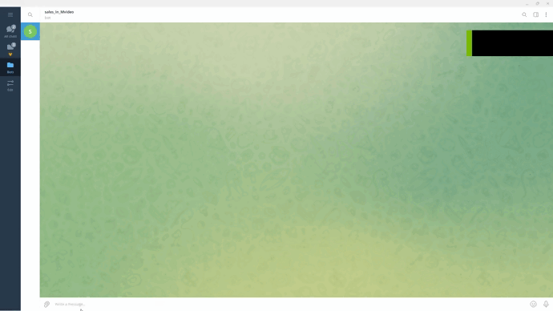

## Парсер MVideo 
**Парсер магазина Мвидео на наличие скидок на определённый вид товаров.**

**Товары:**
- Клавиатуры
- Мониторы
- Видеокарты
- Мышки
- Процессоры

Вывод информации в телеграм бота. Для этого необходимо зарегистрировать своего бота, получить token, создать файл в наименованием .env и в нем переменной 

```
BOT_TOKEN =
```
присвоить значение полученного token'a телеграм бота.

После запуска парсера, переходим в бота, прописываем _/start_ и выбираем товар. Далее парсер собирает информацию по скидкам, выводит информацию по производителям, при выборе которого выводиятся товары.

#### Пример работы бота:
